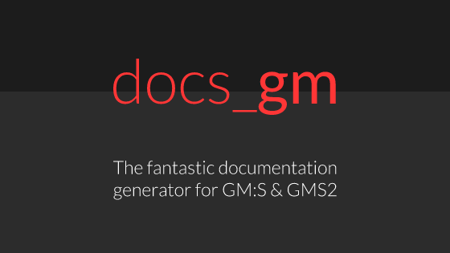

# docs_gm

[](https://greenkeeper.io/)

[](https://www.npmjs.com/package/docs_gm)
[](https://www.npmjs.com/package/docs_gm)
[](https://travis-ci.org/jhm-ciberman/docs_gm)
[](https://coveralls.io/github/jhm-ciberman/docs_gm?branch=master)
[](https://codeclimate.com/github/jhm-ciberman/docs_gm/maintainability)

> The fantastic documentation generator for GameMaker:Studio and GameMaker Studio 2



## ✅ Features

- Supports both GMS1 and GMS2 projects.
- It's Multiplatform! Windows, OSX and Linux supported.
- Easily customizable template engine.
- OnePage and Multipage documentations.
- Supports a lot of JSDoc tags!
- Markdown supported!
- Reports when some scripts are bad documented, or lack documentation.

## ☁️ Installation

Install [Node JS from the official website](https://nodejs.org/).
Then open the windows console and install it with the following command:

```bash
npm install -g docs_gm
```

To view the HELP of docs_gm run the program without arguments:

```bash
docs_gm
```

----------

## ❓ How to use it

### > First: Document your project

You will need to document your scripts following JSDoc syntax. You can learn more about in the [official JSDoc website](http://usejsdoc.org/)

For example:  In the script `my_script`

```js
/// my_script(coffe_type, cakes_number [, clean_after_work]);
/**
 * This script will do a lot of things. Like make
 * coffe, and bake a cake. It will return the
 * index of the generated breakfast.
 *
 * @param {string} coffe_type - The type of coffee
 * you want
 * @param {integer} cakes_number - The number of cakes
 * to bake.
 * @param {boolean} [clean_after_work] - Specify if the
 * table must be cleaned after the baking process.
 * The default is true.
 *
 * @returns {Breakfast} The index of the generated
 * breakfast.
 */

if (argument[0] === "latte") {
   // your code here...
   // blah blah blah
   // more code
}
return foo;
```

docs_gm supports both `/// triple slash comments` and `/** JSDoc single line and multiline comments */`

The following JSDoc tags are supported by gm_docs:

- [`@description`, `@desc`, and inline description (like the above example)](http://usejsdoc.org/tags-description.html)
- [`@param`, `@arg`, `@argument`](http://usejsdoc.org/tags-param.html)
- [`@returns`, `@return`](http://usejsdoc.org/tags-returns.html)
- [`@private`](http://usejsdoc.org/tags-private.html)
- [`@function`, `@func`, `@method`](http://usejsdoc.org/tags-function.html)
- [`@example`](http://usejsdoc.org/tags-example.html)
- More tags will be supported in the next updates

### > Second: Run gm_docs from the command line

Navigate to the directory you have your GameMaker project. For example, for GameMaker:

```bash
cd C:\Users\YOUR_USER\Documents\GameMaker\Projects\my-project-name
```

or for GameMaker:Studio 2 (windows)

```bash
cd C:\Users\YOUR_USER\Documents\GameMakerStudio2\my-project-name
```

To GENERATE the documentation for the current project run:

```bash
docs_gm generate
```

If you want to change the default (Ugly) configuration run the following command and follow the instructions on the screen to add the configuration file to your project.

```bash
docs_gm init
```

You must follow the instructions that appears on the console and then you can edit the configuration file with any text editor and re-run `docs_gm generate`.

## Custom templates

You can create custom HTML templates and use them with docs_gm. Refer to [this page](./custom_templates.md) for how to create a custom template.

## Contribute

I would love to see people interested in contribute to docs_gm. If you have some idea, or bug, you can send a Issue in the github page.

If you want to contribute with the code, first create a fork, then clone it in your local computer (`git clone <REPO URL>`) and then run `npm install` to install all dependencies.

If you use Visual Studio Code as your editor, the project will have configured some tasks to compile and build the typescript faster. Also it will have a Debug profile configured to debug Jest Unit tests.

```bash
# Task names 
# Run them from Visual Studio Code or with "npm run <task>"
build      # Build the entire app
watch      # Run the compiler in watch mode
lint       # Lint the typescript code
clean      # Deletes the ./dist/ folder
test       # Run unit tests
coverage   # Generate test coverage in ./coverage/index.html
```

If not, you can allways run `npm run watch` to start the typescript compiler for the current project directory in watch mode. (Will recompile after any change).

Also, it's recomended that you run `npm run lint` to lint the project.

When you are ready, send a pull request.

Remember that all the latest code is in the `develop` git branch. Never develop new features on  `master`.

## Contributors

- Javier "Ciberman" Mora ([@jhm-ciberman](https://github.com/jhm-ciberman/)) Maintainer
- Peter Hagen ([@phgn0](https://github.com/phgn0))
